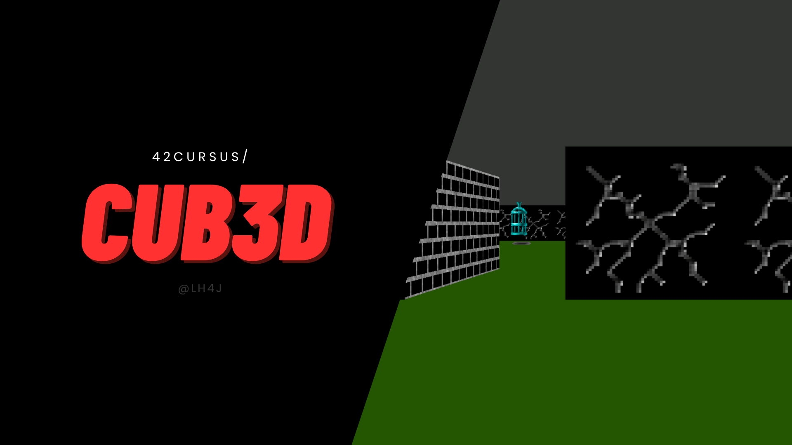

## Cub3D: Can I play, Daddy? / Don't hurt me

<br>



<br>

CUB3D is a 3D graphics project that recreates a simple raycasting engine, similar to early first-person shooter games like Wolfenstein 3D. This project focuses on creating a 3D perspective in a 2D map, implementing player movement, and rendering textured walls using the MiniLibX graphics library.
<br>

##### TABLE OF CONTENT

1. [Setting up MLX and Basic Rendering](#step1-setting-up-mlx-and-basic-rendering)
2. [Implementing Player Movement](#step2-implementing-player-movement)
3. [Developing the Raycasting Algorithm](#step3-developing-the-raycasting-algorithm)
4. [Rendering Walls with Solid Colors](#step4-rendering-walls-with-solid-colors)
5. [Adding Textures](#step5-adding-textures)

<br>

This project is developed in a step-by-step approach, starting with the basic setup and progressively adding more complex features. We begin by setting up the MLX library and creating a basic rendering environment. From there, we'll implement player movement, develop the core raycasting algorithm, add basic wall rendering, and finally incorporate textures. Each step builds upon the previous one, allowing for a structured and manageable development process.

##### PREREQUISITES

- **libmlx**: make sure you have the MiniLibX library installed on your system. You can download it from the official website or compile it from source.
- **cub3d-main**:Download the CUB3D source code from the GitHub repository or clone the repository using Git.

##### BUILDING THE GAME

* Navigate to the CUB3D directory in your terminal or command prompt.
* Run the following command to compile the game:
```
QUIET=1 make
./mad_squishy <map.cub> # replace <map.cub> with the path to your map file
```

##### STEP1: Setting up MLX and Basic Rendering

1. MLX Setup
   - Install MLX library (if not already installed)
   - Link MLX in the Makefile

2. Create a Window
   - Initialize MLX
   - Open a window

3. Basic Rendering
   - Create an image
   - Draw a simple shape (e.g., a rectangle)
   - Display the image in the window

4. Compile and Run
   - Compile the project
   - Test the basic setup

##### STEP2: Implementing Player Movement


##### STEP3: Developing the Raycasting Algorithm


##### STEP4: Rendering Walls with Solid Colors


##### STEP5: Adding Textures